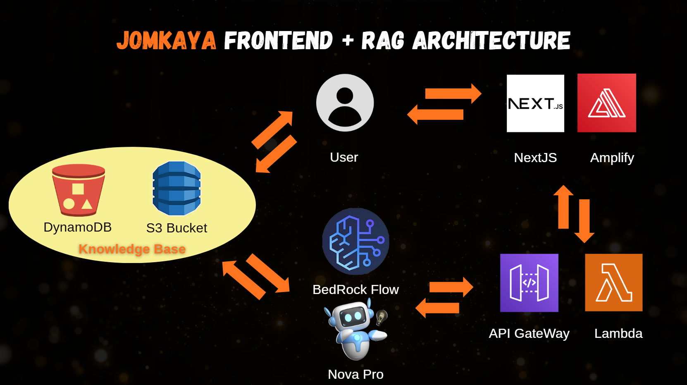
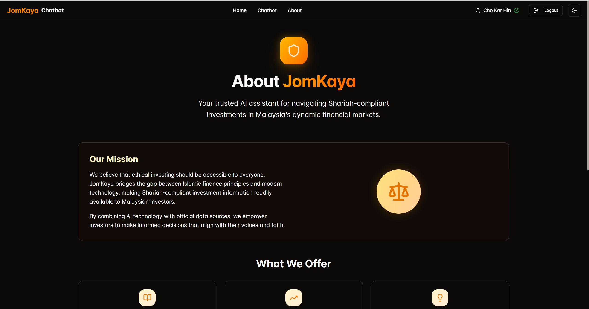

<h1>JomKaya</h1>

<h3>Website : <a href="https://main.d2xt46nqbihpj9.amplifyapp.com/chat">https://main.d2xt46nqbihpj9.amplifyapp.com/chat</a></h3>
<h3>Github : <a href="https://github.com/JokerHin/JomKaya">https://github.com/JokerHin/JomKaya</a></h3>

Our project is an AI-powered Shariah-compliant investment assistant that helps users explore and understand Shariah-compliant investment opportunities in Malaysia. The system not only answers questions about stock compliance, Islamic screening rules, and sectors but also provides personalised investment recommendations that align with Shariah principles.

To make it more inclusive, the assistant can also communicate in Bahasa Melayu, so that even kampung investors (rural community investors) who may not be fluent in English can easily use the platform and gain confidence in making Shariah-compliant financial decisions.

<h2>❗ Problem We Are Solving</h2>

Many investors in Malaysia face challenges when it comes to understanding Shariah compliance in investments:

Lack of Accessibility – Information about Shariah-compliant stocks is often scattered and technical, making it difficult for ordinary investors to verify compliance quickly.

Language Barrier – Most existing tools and resources are in English or use technical financial jargon, which excludes rural or less tech-savvy investors.

Trust & Guidance – Retail investors often don’t know where to start when looking for trustworthy Shariah-compliant investments, leading to confusion or risky choices.

Our assistant solves these problems by: 
✅ Providing instant answers about Shariah compliance and Islamic screening rules.  
✅ Offering recommendations on Shariah-compliant investments. 
✅ Supporting Bahasa Melayu for better accessibility among rural communities. 
✅ Acting as a trusted, AI-powered guide for making informed and halal investment decisions. 

<h2>🏗️ Architecture</h2>

<h2>Technology Used</h2>

<h2>📸 Screenshots</h2>

<h4> Home Page</h4>

<h4>Chat Page</h4>

<h4>About Page</h4>

<h2>🖥️ Running Locally</h2>

# Install dependencies
npm install

# Start dev server
npm run dev

# Build production
npm run build
npm start
